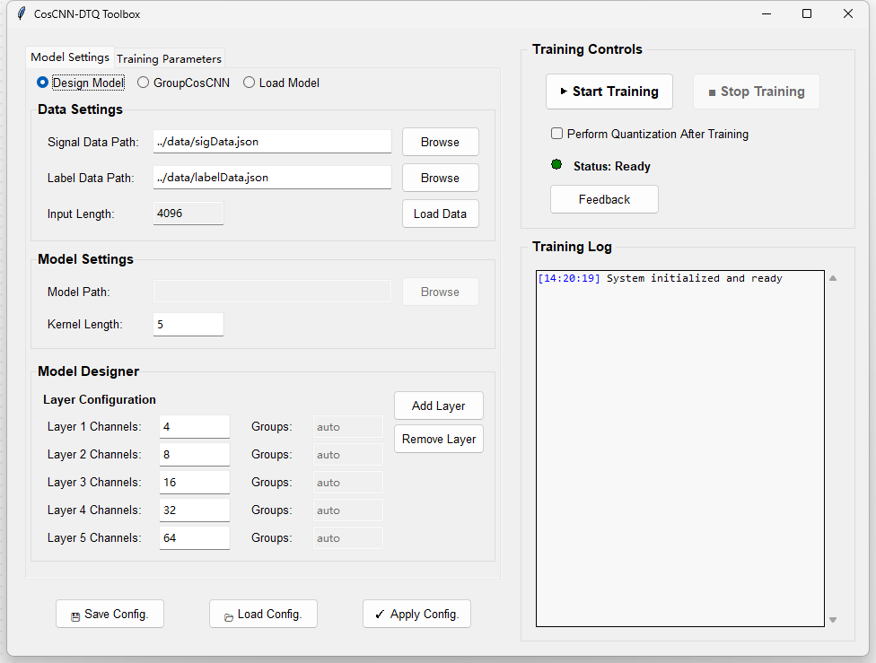

# CosCNN-DTQ Toolbox

[](https://www.gnu.org/licenses/old-licenses/gpl-2.0.en.html)
[](https://www.python.org/downloads/)

An open-source Python toolbox for **1D signal classification** with a focus on **Cosine Convolution (CosConv)** networks and **post-training quantization (PTQ)**.

This repository provides:
- A **desktop GUI** (Tkinter) for model configuration, **stratified k-fold cross-validation** training, and result export.
- A **command-line interface (CLI)** for reproducible training/quantization without the GUI.
- Reference models: **CosCNN** and **GroupCosCNN (GroupConv / grouped CosConv)**.
- A **post-training quantization** pipeline tailored to CosConv-based models (with BN folding, threshold search, LUT-based cosine approximation, and fixed‑point simulation).

> Typical use cases include biosignal time-series classification (e.g., EEG), vibration, acoustics, and other 1D sensor signals.



---

## Key features

### Training & evaluation
- **Stratified K-fold cross-validation** training (per-fold train/val/test split).
- **Model selection**:
  - **CosCNN** (stacked CosConv + BN + pooling + classifier)
  - **GroupCosCNN (GroupConv)**: per-layer **grouped CosConv** with configurable `groups_list`
  - **Custom model loading** from a Python file (GUI "Load Model", and CLI `--model-type custom`)
- Real-time training logs in the GUI (loss / validation accuracy).
- Automatic export of:
  - per-fold checkpoints and configs
  - best-performing model across folds
  - per-fold dataset splits (`data.npz`)

### Models
- **CosConvLayer**: convolution kernels generated from learnable parameters *(A, w)* using cosine basis.
- **CosCNN**: a simple, deployment-friendly baseline for 1D signals.
- **GroupCosCNN (GroupConv)**:
  - supports **grouped cosine convolution per layer**
  - `num_filters_list[i]` is interpreted as **filters per group** (not total filters)
  - total output channels at layer *i*:
    `out_channels = groups_i × num_filters_list[i]`
  - `groups_list` can be set per layer; `None`/`auto` inherits from the previous layer (layer 0 inherits from `in_channels`)

### Quantization (PTQ)
- **Post-training quantization** for CosConv-based networks:
  - feature/activation extraction hooks
  - **BatchNorm folding**
  - threshold/scale search (e.g., KL-based search)
  - **LUT-based cosine approximation** to accelerate CosConv kernel generation
  - fixed-point simulation and quantized model export
- Quantization can be launched:
  - automatically from the training GUI (enable quantization option)
  - manually by running `quantization/main.py`
  - from CLI (`toolbox_cli.py quantize`) for scriptable workflows

> Note: The provided quantization scripts are designed for the toolbox's CosConv-based model families. For arbitrary custom architectures (e.g., ResNet-style), you should ensure CosConv layers are detectable (e.g., using `models.model.CosConvLayer`) before quantization.

---

## Project structure

```
.
├── main.py                    # Launches the training GUI (train/main.py)
├── toolbox_cli.py             # Command-line interface (train / quantize)
├── train/                      # Training GUI + k-fold training logic + data management
│   ├── main.py                 # GUI entry
│   ├── trainer.py              # training / validation / test loops
│   ├── training_ui.py          # GUI widgets
│   ├── data_manager.py         # stratified k-fold split + loaders
│   ├── data_loader.py          # SIG.mat -> JSON exporter
│   └── config.py               # default config values
├── models/
│   ├── model.py                # CosConvLayer, CosCNN, GroupCosCNN (GroupConv)
│   ├── QuantizationModel.py    # quantized inference model definitions
│   └── CustomModel.py          # example custom model template
├── quantization/               # PTQ pipeline
│   ├── main.py                 # quantization entry (with dialogs)
│   ├── feature_extractor.py    # hooks to collect activations/params
│   ├── threshold_finder.py     # threshold search utilities
│   ├── quantizer.py            # BN folding + quantization core
│   └── utils_quantization.py   # helpers (incl. GroupCosCNN arch inference)
├── .gitignore                  # Git ignore rules
├── LICENSE                     # GPL-2.0
└── requirement.txt             # environment snapshot (may be larger than minimal)
```

---

## Installation

### 1) Create an environment (recommended)
```bash
conda create -n coscnn-dtq python=3.9 -y
conda activate coscnn-dtq
```

### 2) Install dependencies
The repository provides `requirement.txt` (a full environment snapshot).

```bash
pip install -r requirement.txt
```

**Minimal requirements** typically include: `torch`, `numpy`, `scipy`, `scikit-learn`, and a working Tkinter installation.

> On Linux, you may need to install Tkinter separately (e.g., `python3-tk` via your package manager).

---

## Data preparation

### Option A: Convert `SIG.mat` → JSON (provided script)
Place your MATLAB dataset at:
```
./data/SIG.mat
```
Then run:
```bash
python train/data_loader.py
```

This generates:
- `./data/sigData.json`
- `./data/labelData.json`

### Option B: Use your own JSON
Provide two files:
- `sigData.json`: list/array with shape **[N, C, L]**
- `labelData.json`: list/array with shape **[N]** (integer labels)

> The toolbox expects **N samples**, **C input channels**, and **L signal length**.

---

## Usage (GUI)

From the project root:
```bash
python main.py
```

### Training workflow
1. Select **CosCNN** / **GroupCosCNN (GroupConv)** / **Load Model**
2. Set:
   - `input_length`
   - `filter_length`
   - `num_filters_list`
   - (GroupCosCNN only) `groups_list` per layer (use `auto` to inherit)
3. Choose:
   - `sigData.json`
   - `labelData.json`
4. Click **Start Training**

### Outputs
All outputs are saved under:
```
./trained_models/
```
Typical per-fold outputs:
- `trained_models/fold_i/model_fold_i.pth`
- `trained_models/fold_i/config.json`
- `trained_models/fold_i/data.npz`  (train/val/test split used by fold i)

Best model summary:
- `trained_models/best_model/`

In addition, the training pipeline exports quantization-related metadata under:
- `./data/in_channels.json`
- `./data/cv_indices.json`
- `./data/fold_{i}_data.json`

---

## Usage (CLI)

The toolbox includes a command-line interface for reproducible training and quantization:

```bash
python toolbox_cli.py -h
python toolbox_cli.py train -h
python toolbox_cli.py quantize -h
```

### 1) Train (CLI)

#### Train a custom model from a `.py` file
Example (same style as the GUI workflow):
```bash
python toolbox_cli.py train \
  --model-type custom \
  --model-file models/CustomModel.py \
  --model-class CustomModel \
  --sig-data data/sigData.json \
  --label-data data/labelData.json \
  --out-dir trained_models \
  --batch-size 32 \
  --max-epochs 50
```

**Custom model requirements**
- `--model-file` must point to a Python file.
- `--model-class` must match a **top-level symbol** inside that file:
  - a `torch.nn.Module` class, or
  - a factory function that returns a `torch.nn.Module`.
- The constructor (or factory) should accept at least `num_classes` (recommended: also accept `in_channels` and `input_length`, or `**kwargs`).

#### Train built-in CosCNN
```bash
python toolbox_cli.py train \
  --model-type design \
  --sig-data data/sigData.json \
  --label-data data/labelData.json \
  --out-dir trained_models
```

#### Train GroupCosCNN (GroupConv)
```bash
python toolbox_cli.py train \
  --model-type group \
  --sig-data data/sigData.json \
  --label-data data/labelData.json \
  --out-dir trained_models \
  --groups-list auto auto auto auto auto
```

> For the full list of model/training arguments (filter length, filters per layer, folds, lr schedule, etc.), use `python toolbox_cli.py train -h`.

### 2) Quantize (CLI)

#### Quantize a single fold checkpoint
```bash
python toolbox_cli.py quantize \
  --checkpoint trained_models/fold_1/model_fold_1.pth \
  --model-type custom \
  --model-file models/CustomModel.py \
  --output quantized_models/fold1_quantized.pth
```

#### Quantize all folds under a directory
```bash
python toolbox_cli.py quantize \
  --trained-model-dir trained_models \
  --model-type custom \
  --model-file models/CustomModel.py \
  --out-dir quantized_models
```

**How the CLI quantization works (high level)**
- The quantizer loads the trained checkpoint, builds the model, and scans for **CosConv** layers.
- If no CosConv layer is found, it will report "Nothing to quantize".
- Quantization results are saved as a `.pth` checkpoint (including the quantized model state and quantization metadata).

> For bit-width and quantization configuration, use `python toolbox_cli.py quantize -h`.

---

## Usage (Quantization UI)

### From GUI
Enable the **Quantization** option in the training GUI. After training, the toolbox launches the quantization workflow automatically.

### From command line (UI dialogs)
Run:
```bash
python quantization/main.py
```

Quantization reads trained checkpoints under `./trained_models/` and exports quantized models under:
```
./quantized_models/
```

---

## Custom model loading (GUI)

The GUI "Load Model" option loads a model from a `.py` file. For compatibility with the current GUI loader:
- your Python file must define a top-level class named **`CustomModel`**
- `CustomModel` should be a `torch.nn.Module`
- the constructor should accept at least: `num_classes`

Example:
```python
import torch.nn as nn

class CustomModel(nn.Module):
    def __init__(self, num_classes=3):
        super().__init__()
        # define layers ...
        self.fc = nn.Linear(128, num_classes)

    def forward(self, x):
        # x: [B, C, L]
        return self.fc(...)
```

---

## License

This project is released under the **GNU General Public License v2.0 (GPL-2.0)**. See `LICENSE` for details.

---

## Citation

If you use this toolbox in academic work, please cite this repository and, where applicable, the related manuscripts:

- G. Liu, L. Tian, Y. Wen, W. Yu, W. Zhou, *Cosine Convolutional Neural Network and Its Application for Seizure Detection*, Neural Networks, 2024.
- G. Liu, S. Ren, J. Wang, W. Zhou, *Efficient Group Cosine Convolutional Neural Network for EEG-based Seizure Identification*, IEEE Transactions on Instrumentation and Measurement, 2025.

---

## Contributing

We welcome contributions from the community! Here's how you can help:

### Reporting Issues
- Use the **Feedback** button in the GUI to get contact information
- Open an issue on GitHub with a clear description of the bug or feature request
- Include steps to reproduce bugs, expected vs. actual behavior, and your environment details

### Submitting Changes
1. Fork the repository
2. Create a feature branch (`git checkout -b feature/your-feature-name`)
3. Make your changes
4. Commit your changes with clear, descriptive messages
5. Push to your fork and submit a pull request

### Development Guidelines
- Follow PEP 8 style guidelines for Python code
- Add docstrings to new functions and classes
- Update documentation (README) when adding features

---

## Contact

Corresponding author: Guoyang Liu — `gyliu@sdu.edu.cn` (cc: `virter1995@outlook.com`)

For feedback, questions, or bug reports, you can also use the **Feedback** button in the GUI application.
