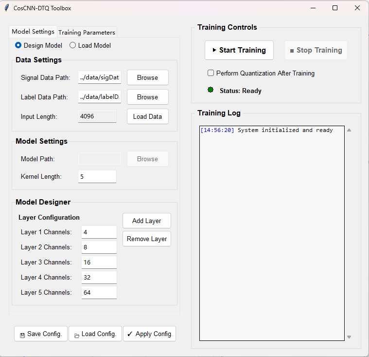

# CosCNN-DTQ Toolbox: A Python-based Platform for Deep Learning Model Training and Quantization v1.0

This work develops a Python-based deep learning toolbox, the **CosCNN-DTQ Toolbox**. It is a standalone application that provides a comprehensive platform for training and evaluating deep learning models for classification tasks. The toolbox features:
1.  An intuitive graphical user interface (GUI) for configuring training parameters, performing k-fold cross-validation, and visualizing results in real-time.
2.  A post-training quantization pipeline to optimize the best-performing model for efficient deployment.



## Citation

Please cite the tool using this repository and the relevant manuscripts:

-   G. Liu, L. Tian, Y. Wen, W. Yu, W. Zhou, "Cosine Convolutional Neural Network and Its Application for Seizure Detection," *Neural Networks*, 2024.
-   G. Liu, S. Ren, J. Wang, W. Zhou, "Efficient Group Cosine Convolutional Neural Network for EEG-based Seizure Identification," *IEEE Transactions on Instrumentation and Measurement*, 2025.

## Operating Environments and Dependencies

**System:**
- Windows

**Software & Dependencies:**
- Python 3.7+
- PyTorch (>=1.8.0)
- NumPy (>=1.20.0)

You can install the dependencies using the following command:
```bash
pip install -r requirements.txt
```

## Usage

1.  **Prepare Data**:
    -   The raw dataset is provided in a MATLAB file located at ./data/SIG.mat.
    -   To convert this data into the JSON format required by the application, you must first run the preprocessing script. The script is located at train/data_loader.py, execute:
        ```bash
        python train/data_loader.py
        ```

    -   This script will process SIG.mat and generate sig_data.json and label_data.json in the ./data/ directory.
    -   Signal Data (sig_data.json): A JSON file containing a list of samples, where each sample is a 2D list of shape [channels, signal_length].
    -   Label Data (label_data.json): A JSON file containing a list of integer labels corresponding to the signal data.

2.  **Run the Application**:
    -   Navigate to the project's root directory.
    -   Execute the main script to launch the GUI:
        ```bash
        python main.py
        ```
    -   Use the GUI to load your data files and configure the model and training parameters.
    -   Click "▶ Start Training" to begin the process. The results will be saved in the `./trained_models/` directory.

## Note

-   `/models` contains the Python script defining the default `CosCNN` model architecture.
-   `/data` is the default directory to store your input datasets (e.g., `sig_data.json`, `label_data.json`).
-   `/trained_models` is the output directory where all results are saved. It contains subfolders for each training fold (`fold_1`, `fold_2`, etc.) and a `best_model` folder for the overall best-performing model. Each folder includes the model state (`.pth`), configuration (`.json`), and the specific data split (`.npz`) used.
-   `/quantization` contains the external script used for post-training quantization if the option is enabled in the GUI.
-   `main.py` is the main entry point to run the application.
-   `trainer.py`, `training_ui.py`, `data_manager.py`, and `config.py` contain the core logic for the training process, GUI, and data handling, respectively.

## Corresponding Author
If there is any technical issue, please contact the corresponding author Guoyang Liu: `gyliu@sdu.edu.cn` (please also cc `virter1995@outlook.com`).
Visit [http://guoyang.work/](http://guoyang.work/) for more related works.